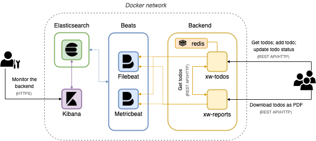

# demo-elastic-observability
A sample environment running on Docker to showcase IT monitoring with the Elastic Stack. The monitored web apps support the backend of a simple todos application.

## The architecture
The demo environment consists of:
- a `backend` composed of two web apps exposed as REST APIs. The apps are written in Python using the [FastAPI](https://fastapi.tiangolo.com/) framework and run with the [Uvicorn](https://www.uvicorn.org/) server. In particular:
    - the `xw-todos` app allows to read/create/update a todo item. It uses Redis as a persistence layer.
    - the `xw-reports` app allows to download a PDF summary of all todos, fetched via a REST call from `xw-todos`.
- a one-node `Elasticsearch` cluster
- a single instance of `Kibana`, connected to the Elasticsearch cluster
- two running Beats to collect observability data from the backend: a `Filebeat` module to crawl and fetch logs, and a `Metricbeat` module to collect performance metrics regularly.

The diagram below displays the overall architecture of the demo environment.


## How to run the demo
All components of the demo environment run in Docker containers, in the same virtual Docker network. One can spin up the whole environment using docker compose.

To deploy the two web apps and the single Redis instance: 
```
docker-compose -f path/to/this/repo/apps-docker-compose.yml up
```

To deploy the Elasticsearch cluster and the Kibana instance:
```
docker-compose -f path/to/this/repo/elasticsearch-docker-compose.yml up
```

To deploy the two Beats modules:
```
docker-compose -f path/to/this/repo/beats-docker-compose.yml up
```

To deploy everything at once, well:
```
docker-compose -f path/to/this/repo/apps-docker-compose.yml -f path/to/this/repo/elasticsearch-docker-compose.yml -f path/to/this/repo/beats-docker-compose.yml up
```

## Apps' API Documentation
The APIs of the `xw-todos` and `xw-reports` app are documented in Swagger and accessible at "`/docs`". Below, just a quick overview:

### `xw-todos`
- `GET /`: greetings
- `GET /todos?(showAll=true|false)`: get all the persisted todos. The optional `showAll` parameter allows you to request only the uncompleted ones (default behaviour) or all of them
- `GET /todos/{id}`: get a todo by id
- `GET /todos/{id}/done`: update the status of the todo with the provided id, to mark it as done
- `GET /todos/{id}/undone`: update the status of the todo with the provided id, to mark it as not done
- `POST /todos`: create a new todo. Data is passed in the request body as JSON. 

### `xw-reports`:
- `GET /`: greetings
- `GET /report`: get a PDF with the list of all the todos